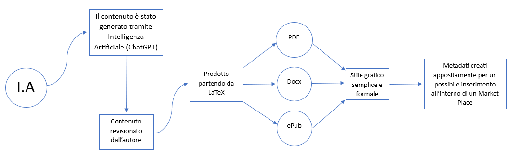

{width=100px height=100px}

# Titolo Progetto d'Esame
Football Americano per Principianti

## Introduzione
Il Progetto consiste in un Saggio che spiega in modo semplice ed efficace la storia, le regole e la cultura che stanno dietro al Football Americano.  
Gli obiettivi del progetto stanno nel far conoscere questo sport a coloro che si vogliono affacciare ad esso e vogliono farlo attraverso del materiale che permetta la fruizione su più dispositivi possibile, facilitando anche chi è meno confidente con le tecnologie utilizzate.  
I contenuti, le regole e la storia sono stati creati attraverso l'utilizzo di Intelligenza Artificiale (Chat GPT), con un processo di revisione mia, coadiuvato da fonti web attendibili.  
I risultati raggiunti consistono nella creazione di materiale attendibile e di facile comprensione.

## Ideazione 

### Tema
Il tema principale di questo prodotto editoriale è sicuramente lo sport. È un tema molto di tendenza, soprattutto nel periodo tra la fine di Gennaio e l'inizio di Febbraio (periodo corrispondente a play-off di NFL e Super Bowl). Inoltre, questo tema presenta come argomenti correlati anche la musica e l'intrattenimento, in quanto protagonisti degli eventi precedentemente descritti.

### Destinatari
{width=200px height=200px}  
https://it.semrush.com/persona/share/YaSWRTMEEVs-pn8ZJ-340oVwSn0MBRkdoGxlC6icbH8/

{width=200px height=200px}  
https://it.semrush.com/persona/share/d4wrqV3_YRxjq2Hd7uwm6FWZbpw37w1edXrY69mk9CQ/

### Requisiti di accettazione
Per i destinatari di questo progetto sono più efficaci modelli come Smartphone o Tablet, in quanto estremamente adatti alla fruizione di questo determinato contenuto. Inoltre sono di facile utilizzo anche per coloro che hanno meno dimestichezza con queste tecnologie e hanno una curva di apprendimento abbastanza verticale. La portabilità è massima, poiché, per i formati con cui il contenuto può essere fruito, è possibile accedervi praticamente su qualsiasi dispositivo.  
Sarebbe possibile estendere il progetto anche ad altre estensioni (come ad esempio l'azw3 del Kindle).  
Il contenuto del progetto è stato creato quasi completamente da Intelligenza Artificiale, ma è stato sottoposto a revisione, in quanto sarebbe potuta esserci qualche imprecisione nella stesura, ad esempio, delle regole oppure un racconto poco chiaro della storia. In ogni caso la qualità dei contenuti è alta.

### Canali di distribuzione
Il principale canale di distribuzione che si intende raggiungere è sicuramente il Web: attraverso esso sarebbe possibile la rapida diffusione, anche in formati diversi, come PDF, ePub o DOCX.  
Si potrebbe, eventualmente, raggiungere un Market Place, dove vendere questo prodotto. In tal caso i formati dipenderebbero dai vari Market Place: ad esempio, per il Kindle, si utilizzerebbe il formato azw3, mentre per Google Play Libri si utilizzerebbe il formato ePub (in particolare ePub3).  
Per la realizzazione del progetto ho utilizzato LaTeX, in quanto ho preferito, rispetto ad altri linguaggi, il modo in cui formatta i libri/saggi.  
Ho scelto uno stile più formale in quanto ritengo sia molto efficace la modalità di comunicazione simile a quella di un libro per la tipologia di contenuto.

## Processo di Produzione

### Acquisizione dei contenuti
Prima di tutto ho cercato su answerthepublic.com la parola "football americano" e si è evinto che la maggior parte delle ricerche su questo tema riguardano dove vedere il football americano, le varie città per cercare scuole di questo sport e la differenza tra quest'ultimo e il rugby.  
Una volta capito che c'è frammentazione e poca chiarezza sulle informazioni di questa tema, ho proceduto con la generazione automatica di contenuto, con la personale revisione.

### Gestione documentale

### Tecnologie adottate

Descrivere le tecnologie addottate nelle diverse fasi e discuterne il contributo in termini di raggiungimento degli obiettivi descritti negli scenari d'uso.

|                |Scenario 1                       |Scenario 2                                      |
|----------------|---------------------------------|------------------------------------------------|
|PDF             |Di facile condivisione           |Portabile su diversi dispositivi                |
|Docx            |Eventualmente modificabile       |Bel layout                                      |
|ePub            |Integrabile nella libreria Google|Permette una formattazione ideale per la lettura|

### Esecuzione del flusso
https://github.com/DavideMule/Editoria-Digitale.git

## Valutazione dei risultati raggiunti

### Valutazione del flusso di produzione
La gestione documentale ha avuto una notevole riduzione dei tempi, data dalla generazione dei contenuti da parte di Intelligenza Artificiale. Questa riduzione di tempo ha portato, però, alla presenza di alcuni errori da parte del generatore di contenuti, che ha costretto una revisione accurata di essi.  
Il progetto è sicuramente accessibile tramite molte soluzioni, dato anche dal numero e dalla tipologia di formati che esso supporta. Ciò permette anche l'aumento dei dispositivi con cui è possibile accedere alla risorsa.  

### Confronto con lo stato dell'arte
Confrontando i contenuti del progetto con quelli che si trovano sul web, ho fatto fatica a trovare dei saggi che spiegassero in modo facile questo tema.  
Inoltre la mia versione implementa anche il formato azw3, utilizzato da Amazon per il Kindle.

### Limiti emersi
Alcuni dei limiti emersi sono stati:  
1. la poca interattività di alcuni formati, come ad esempio l'ePub;  
2. la creazione del file del progetto in azw3 è stato prodotto attraverso convertitore online, dato che Pandoc non supporta il formato. Ciò non ha dato la possibilità di convertire nel migliore dei modi il file, ad esempio facendo qualche errore con la formattazione dell'indice;  
3. il contenuto generato dall'Intelligenza Artificiale ha, talvolta, riportato qualche errore, che ha dovuto comportare un'attenta revisione.

## Conclusioni
In conclusione, mi permetto di affermare che il saggio è un prodotto di qualità, in quanto riesce a raggiungere i suoi obiettivi di semplicità e comprensibilità. La multicanalità e la portabilità sono un punto forte di questo progetto, poichè usufruibile tramite diversi dispotivi in diversi formati.  
Purtroppo sono emersi anche dei limiti, riguardanti la conversione di un formato e la poca interattività di altri formati.  
Nonostante tutto, reputo il progetto soddisfacente, con qualche margine di miglioramento che lo porterebbe ad un maggior livello di soddisfazione.

## Bibliografia e sitografia
1. ChatGPT: https://chat.openai.com/
2. Wikipedia :  
+ https://it.wikipedia.org/wiki/Football_americano  
+ https://it.wikipedia.org/wiki/National_Football_League